<h5 style="color: yellowgreen; text-align: center">
  This GitHub landing page is undergoing maintenance. Therefore, certain
  icons/links might display/function incorrectly.
</h5>
 

  

<!--
**dibyarupnath/dibyarupnath** is a ✨ _special_ ✨ repository because its `README.md` (this file) appears on your GitHub profile.
-->

<h2 style="text-align: center"><strong>💁🏻‍♂️ About Me</strong></h2>

- 📖 **6 Y. B.Tech Integrated (Diploma + B.Tech)** in **Computer Science and Engineering** at **[Techno India University]**, Class of 2024 (Bronze Medallist 🥉).

- 🖥️ Fields that interest me the most include **Cloud Computing, AI/ML (Agentic AI, GenAI, Quantum-Enabled AI, Self-Driving Cars), Data, FinTech, Process & Strategy**.

- 🤝 Ex-Rotaractor at RACCP, RID 3291 (2021-23) and RACDCP, RID 3240 (2023-24).

- 📷 My hobbies include **Chess, Wildlife Photography, Linguistics, Cooking, and Lawn Tennis**.

<!-- Let's Connect  -->
 

  

    <h2 style="display: inline"><strong>➕ Let's Connect </strong></h2>
  

  

    <a href="mailto:dibyarupnath@gmail.com" target="_blank">
       </a
    >&emsp;&emsp;
    
    &emsp;&emsp;
    
    &emsp;&emsp;
    
    &emsp;&emsp;
    
    &emsp;&emsp;
    <!--  &emsp;&emsp; -->
    <!--  &emsp;&emsp; -->
  

<!-- Dev Profiles -->
 

  

    <h2 style="display: inline"><strong>🏆 My Developer Profiles </strong></h2>
  

  

    
    &emsp;&emsp;
    
    &emsp;&emsp;
    
    &emsp;&emsp;
    <a
      href="https://www.cloudskillsboost.google/public_profiles/8e032c15-b702-448d-bc54-c61181c52fe9/"
      target="_blank"
    >
       </a
    >&emsp;&emsp;
    
    &emsp;&emsp;
    
    &emsp;&emsp;
    
    &emsp;&emsp;
    
    &emsp;&emsp;
  

<!-- 🤖 AI Tools & Utilities I Use/Learn -->
 

  

    <h2 style="display: inline">
      <strong>🤖 AI Tools & Utilities I Use/Learn</strong>
    </h2>
  

  

    <a href="https://huggingface.co/" target="_blank">
       </a
    >&emsp;&emsp;
    <a href="https://n8n.io/" target="_blank">
      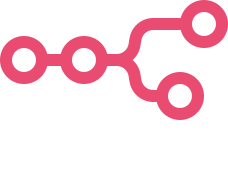 </a
    >&emsp;&emsp;
    <a href="https://claude.com/" target="_blank">
       </a
    >&emsp;&emsp;
    <a href="https://copilot.microsoft.com/" target="_blank">
       </a
    >&emsp;&emsp;
    <a href="https://github.com/features/copilot" target="_blank">
       </a
    >&emsp;&emsp;
    <a href="https://www.langchain.com/" target="_blank">
       </a
    >&emsp;&emsp;
    <a href="https://www.langchain.com/langgraph" target="_blank">
       </a
    >&emsp;&emsp;
    <a href="https://www.atlassian.com/software/rovo" target="_blank">
       </a
    >&emsp;&emsp;
    <a href="https://www.databricks.com/product/genie/one" target="_blank">
       </a
    >&emsp;&emsp;
    <a href="https://chatgpt.com/" target="_blank">
      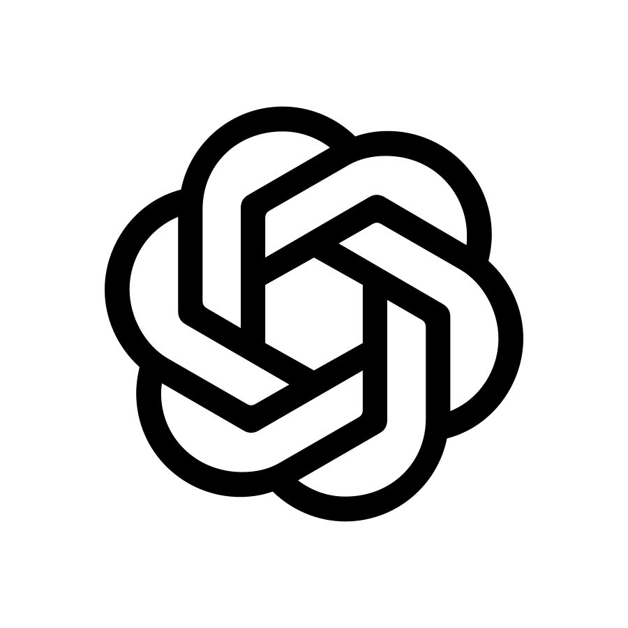 </a
    >&emsp;&emsp;
    <a href="https://chat.deepseek.com/" target="_blank">
       </a
    >&emsp;&emsp;
    <a href="https://www.kimi.com/" target="_blank">
       </a
    >&emsp;&emsp;
    <a href="https://grok.com/" target="_blank">
       </a
    >&emsp;&emsp;
    <a href="https://www.perplexity.ai/" target="_blank">
       </a
    >&emsp;&emsp;
    <a href="https://firefly.adobe.com/" target="_blank">
       </a
    >&emsp;&emsp;
    <a href="https://www.midjourney.com/" target="_blank">
       </a
    >&emsp;&emsp;
    <a href="https://elevenlabs.io/" target="_blank">
       </a
    >&emsp;&emsp;
    <a href="https://lovable.dev/" target="_blank">
       </a
    >&emsp;&emsp;
    <a href="https://mistral.ai/" target="_blank">
       </a
    >&emsp;&emsp;
    
    &emsp;&emsp;
    <a href="https://developer.apple.com/apple-intelligence/" target="_blank">
       </a
    >&emsp;&emsp;
    <a href="https://developer.apple.com/apple-intelligence/" target="_blank">
       </a
    >&emsp;&emsp;
  

<!-- Programming/Markdown/Scripting Languages I Use/Know -->
 

  

    <h2 style="display: inline">
      <strong>📜 Programming/Markdown/Scripting Languages I Use/Know</strong>
    </h2>
  

  

    <a href="https://www.python.org" target="_blank">
       </a
    >&emsp;&emsp;
    <a href="https://www.r-project.org/" target="_blank">
       </a
    >&emsp;&emsp;
    <a href="https://www.markdownguide.org/" target="_blank">
       </a
    >&emsp;&emsp;
    <a href="https://www.w3schools.com/cpp/" target="_blank">
      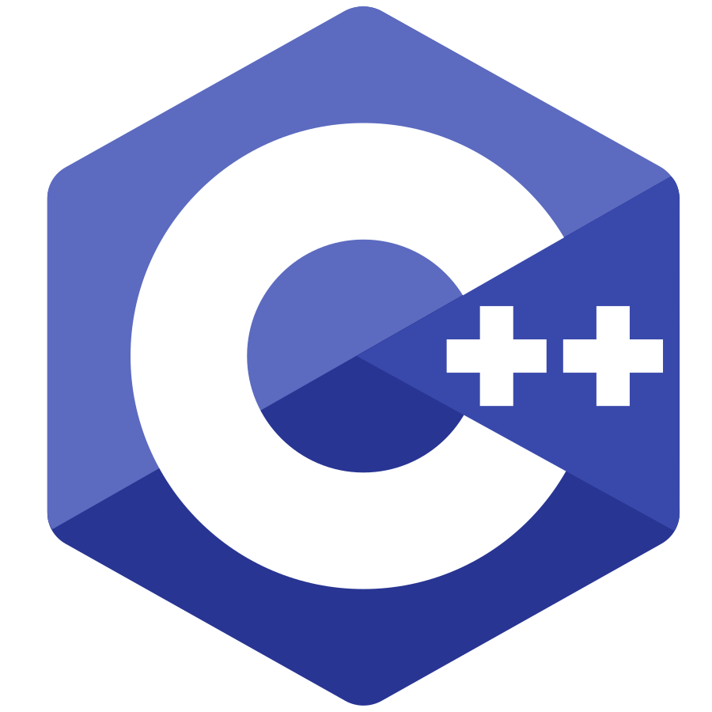
    </a>
    &emsp;&emsp;
    
    &emsp;&emsp;
    
    &emsp;&emsp;
    
    &emsp;&emsp;
    <a href="https://www.java.com/" target="_blank">
       </a
    >&emsp;&emsp;
    
    &emsp;&emsp;
    
    &emsp;&emsp;
    
    &emsp;&emsp;
    <a href="https://www.w3schools.com/css/" target="_blank">
      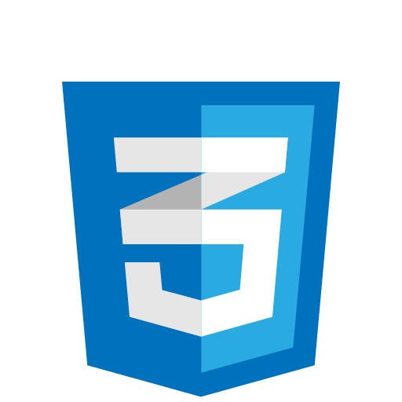
    </a>
    &emsp;&emsp;
    <a href="https://go.dev/" target="_blank">
       </a
    >&emsp;&emsp;
    <a href="https://kotlinlang.org/" target="_blank">
       </a
    >&emsp;&emsp;
    
    &emsp;&emsp;
    
    &emsp;&emsp;
    <a href="https://www.latex-project.org/" target="_blank">
       </a
    >&emsp;&emsp;
    
    &emsp;&emsp;
    
    &emsp;&emsp;
    
    &emsp;&emsp;
    <!-- &emsp;&emsp; -->
    <!-- &emsp;&emsp; -->
  

<!--📊 Data Tools I Use/Learn -->
 

  

    <h2 style="display: inline"><strong>📊 Data Tools I Use/Learn</strong></h2>
  

  

    
    &emsp;&emsp;
    
    &emsp;&emsp;
    
    &emsp;&emsp;
    
    &emsp;&emsp;
    <a href="https://www.microsoft.com/en-us/sql-server" target="_blank">
       </a
    >&emsp;&emsp;
    
    &emsp;&emsp;
    
    &emsp;&emsp;
    
    &emsp;&emsp;
    
    &emsp;&emsp;
    
    &emsp;&emsp;
    
    &emsp;&emsp;
    
    &emsp;&emsp;
    
    &emsp;&emsp;
    <a href="https://www.jetbrains.com/datalore/" target="_blank">
       </a
    >&emsp;&emsp;
    <a href="https://www.jetbrains.com/dataspell/" target="_blank">
       </a
    >&emsp;&emsp;
    <a href="https://www.jetbrains.com/datagrip/" target="_blank">
       </a
    >&emsp;&emsp;
    
    &emsp;&emsp;
    
    &emsp;&emsp;
    
    &emsp;&emsp;
    
    &emsp;&emsp;
    
    &emsp;&emsp;
    
    &emsp;&emsp;
    
    &emsp;&emsp;
    
    &emsp;&emsp;
  

<!--📚 Libraries & Frameworks I Use & Learn -->
 

  

    <h2 style="display: inline">
      <strong>📚 Libraries & Frameworks I Use/Learn</strong>
    </h2>
  

  

    
    &emsp;&emsp;
    
    &emsp;&emsp;
    
    &emsp;&emsp;
    <a href="https://www.tensorflow.org/" target="_blank">
       </a
    >&emsp;&emsp;
    <a href="https://scikit-learn.org/" target="_blank">
       </a
    >&emsp;&emsp;
    
    &emsp;&emsp;
    
    &emsp;&emsp;
    
    &emsp;&emsp;
    
    &emsp;&emsp;
    <a href="https://rubyonrails.org/" target="_blank">
      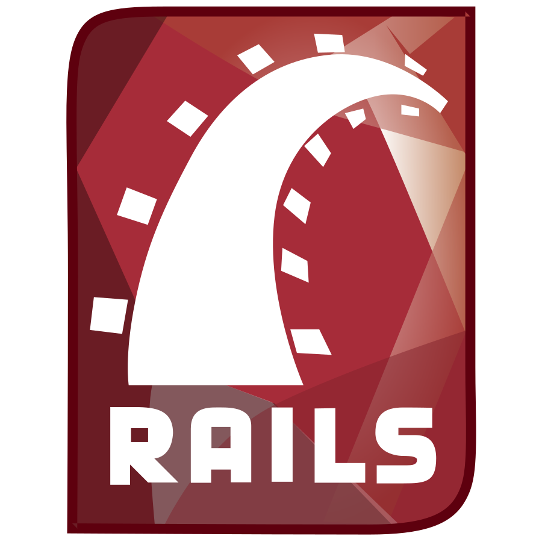
    </a>
    &emsp;&emsp;
    
    &emsp;&emsp;
  

<!--🎀 Frontend Libraries/Frameworks/Tools I Use & Learn -->
 

  

    <h2 style="display: inline">
      <strong>🎀️ Frontend Tools/Libraries/Frameworks I Use/Learn</strong>
    </h2>
  

  

    
    &emsp;&emsp;
    
    &emsp;&emsp;
    <a href="https://sites.google.com/" target="_blank">
       </a
    >&emsp;&emsp;
    
    &emsp;&emsp;
    
    &emsp;&emsp;
    <a href="https://www.chartjs.org/" target="_blank">
      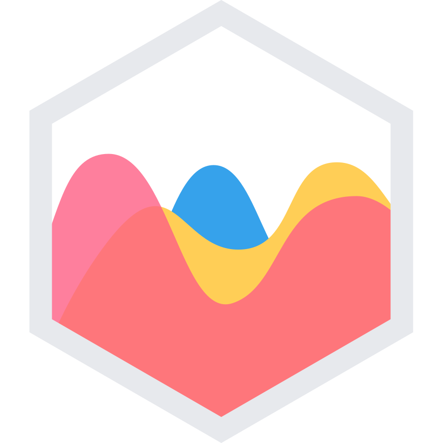
    </a>
    &emsp;&emsp;
  

<!--💻 IDEs & Other Technial Services I Use/Learn -->
 

  

    <h2 style="display: inline">
      <strong>💻 IDEs & Code Editors I Use</strong>
    </h2>
  

  

    <a href="https://code.visualstudio.com/" target="_blank">
       </a
    >&emsp;&emsp;
    
    &emsp;&emsp;
    <a href="https://www.jetbrains.com/pycharm/" target="_blank">
       </a
    >&emsp;&emsp;
    <a href="https://www.jetbrains.com/idea/" target="_blank">
       </a
    >&emsp;&emsp;
    <a href="https://www.jetbrains.com/clion/" target="_blank">
       </a
    >&emsp;&emsp;
    <a href="https://www.jetbrains.com/go/" target="_blank">
       </a
    >&emsp;&emsp;
    <a href="https://atom.io/" target="_blank">
       </a
    >&emsp;&emsp;
    <a href="https://www.sublimetext.com/" target="_blank">
       </a
    >&emsp;&emsp;
    <a href="https://posit.co/downloads" target="_blank">
       </a
    >&emsp;&emsp;
    <a href="https://jupyter.org/" target="_blank">
      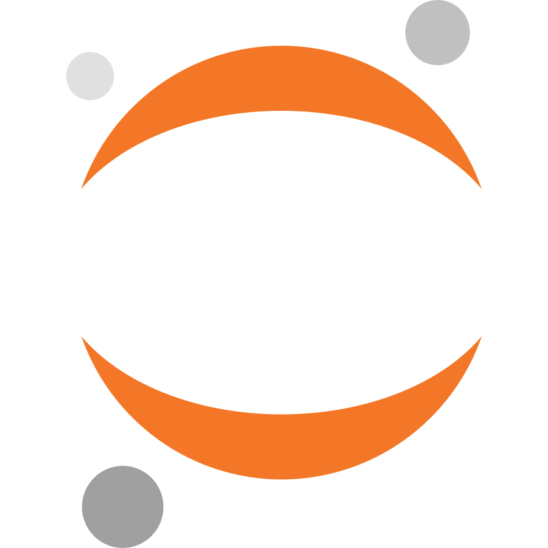
    </a>
    &emsp;&emsp;
    <a href="https://www.jetbrains.com/ruby/" target="_blank">
       </a
    >&emsp;&emsp;
    <a href="https://www.jetbrains.com/rust/" target="_blank">
       </a
    >&emsp;&emsp;
    <a href="https://air.dev/" target="_blank">
       </a
    >&emsp;&emsp;
    <a href="https://eclipseide.org/" target="_blank">
       </a
    >&emsp;&emsp;
    <a href="https://cursor.com/" target="_blank">
       </a
    >&emsp;&emsp;
    <a href="https://devin.ai/desktop/" target="_blank">
       </a
    >&emsp;&emsp;
    <a href="https://www.framer.com/" target="_blank">
      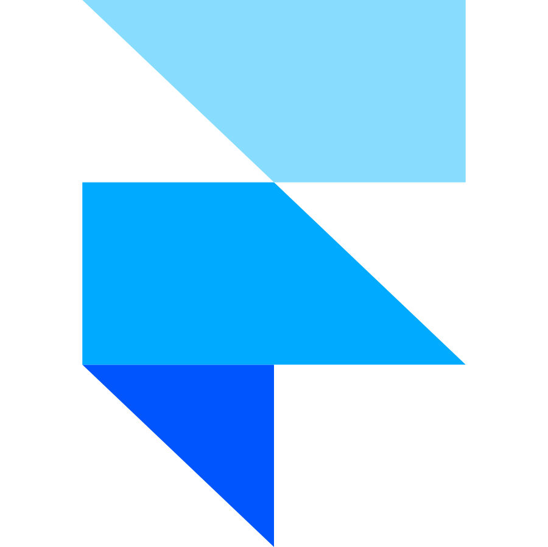 </a
    >&emsp;&emsp;
    <a href="https://codepen.io/" target="_blank">
       </a
    >&emsp;&emsp;
    <a href="https://notepad-plus-plus.org/" target="_blank">
       </a
    >&emsp;&emsp;
    <a href="https://www.vim.org/" target="_blank">
       </a
    >&emsp;&emsp;
  

<!--🛠️ Dev Tools & Utilities I Use -->
 

  

    <h2 style="display: inline">
      <strong>🛠️ Dev Tools & Utilities I Use</strong>
    </h2>
  

  

    <a
      href="https://www.microsoft.com/en-in/power-platform/products/power-automate"
      target="_blank"
    >
       </a
    >&emsp;&emsp;
    <a href="https://kubernetes.io/" target="_blank">
       </a
    >&emsp;&emsp;
    <a href="https://www.docker.com/" target="_blank">
      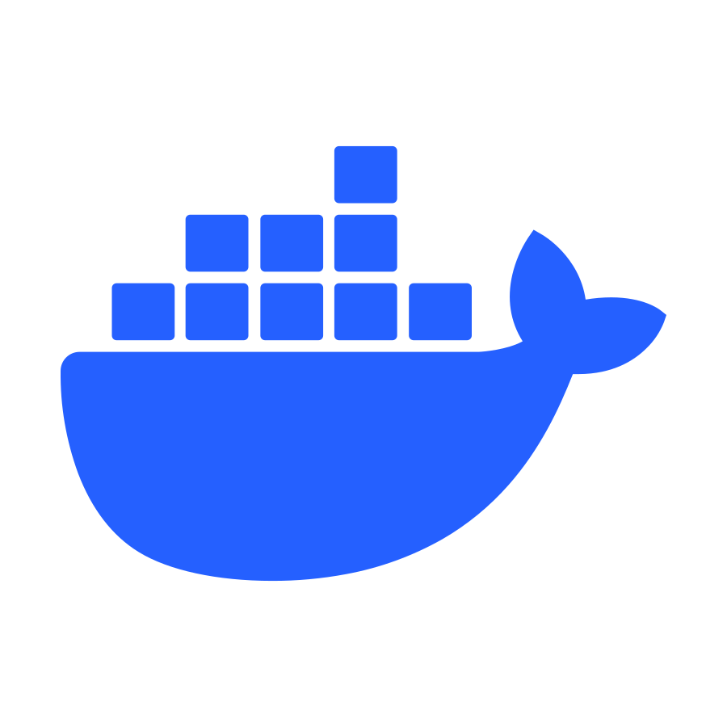 </a
    >&emsp;&emsp;
    <a href="https://developer.hashicorp.com/terraform" target="_blank">
      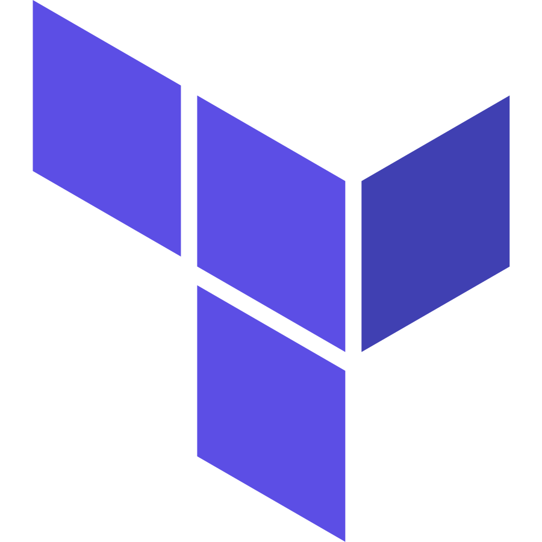 </a
    >&emsp;&emsp;
    <a href="https://www.postman.com/" target="_blank">
       </a
    >&emsp;&emsp;
    <a href="https://supabase.com/" target="_blank">
       </a
    >&emsp;&emsp;
    <a href="https://vercel.com/" target="_blank">
      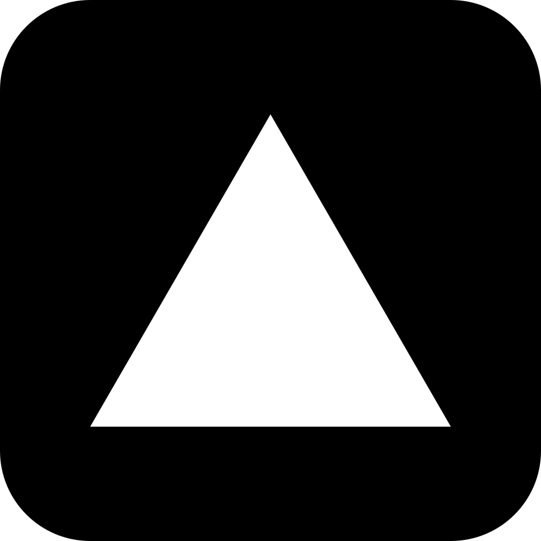 </a
    >&emsp;&emsp;
    <a href="https://www.netlify.com/" target="_blank">
       </a
    >&emsp;&emsp;
    <a href="https://wordpress.com/" target="_blank">
       </a
    >&emsp;&emsp;
    <a href="https://www.jenkins.io/" target="_blank">
       </a
    >&emsp;&emsp;
    <a href="https://github.com/features/actions" target="_blank">
       </a
    >&emsp;&emsp;
    <a href="https://azure.microsoft.com/en-us/products/devops" target="_blank">
       </a
    >&emsp;&emsp;
    <a href="https://www.drawio.com/" target="_blank">
       </a
    >&emsp;&emsp;
    <a
      href="https://www.microsoft.com/en-in/microsoft-365/visio"
      target="_blank"
    >
       </a
    >&emsp;&emsp;
    <a href="https://git-scm.com/" target="_blank">
      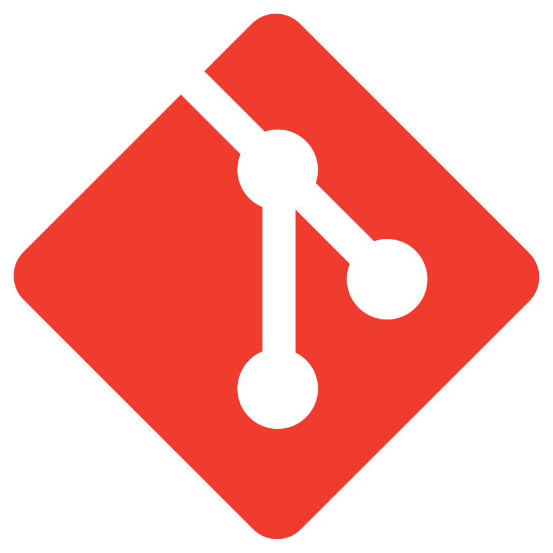 </a
    >&emsp;&emsp;
    <a href="https://github.com/" target="_blank">
       </a
    >&emsp;&emsp;
    
    &emsp;&emsp;
    <a href="https://www.gitlab.com" target="_blank">
       </a
    >&emsp;&emsp;
    
    &emsp;&emsp;
    <a href="https://www.anaconda.com/" target="_blank">
       </a
    >&emsp;&emsp;
    <a href="https://nodejs.org/en" target="_blank">
      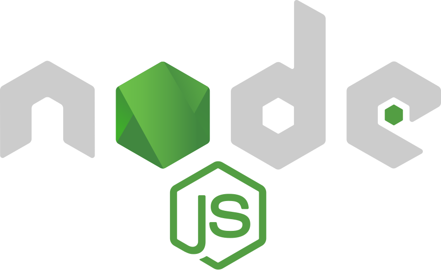 </a
    >&emsp;&emsp;
    <a href="https://www.npmjs.com/" target="_blank">
       </a
    >&emsp;&emsp;
    <a href="https://developers.google.com/apps-script" target="_blank">
       </a
    >&emsp;&emsp;
    <a href="https://www.vmware.com/" target="_blank">
       </a
    >&emsp;&emsp;
    <a href="https://www.virtualbox.org/" target="_blank">
       </a
    >&emsp;&emsp;
  

<!--☁️ Cloud Platforms I Use & Learn -->
 

  

    <h2 style="display: inline">
      <strong>☁️ Cloud Platforms I Use & Learn</strong>
    </h2>
  

  

    <a href="https://azure.microsoft.com/en-in/" target="_blank">
      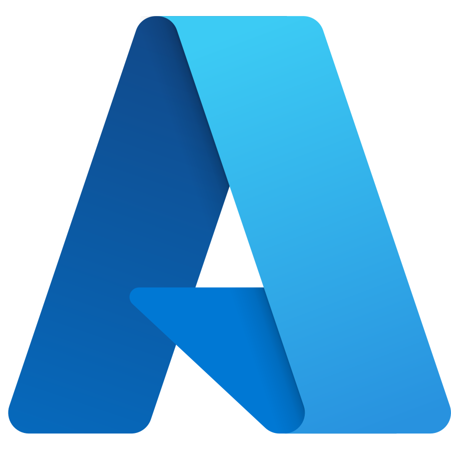</a
    >&emsp;&emsp;
    <a href="https://cloud.google.com/" target="_blank">
      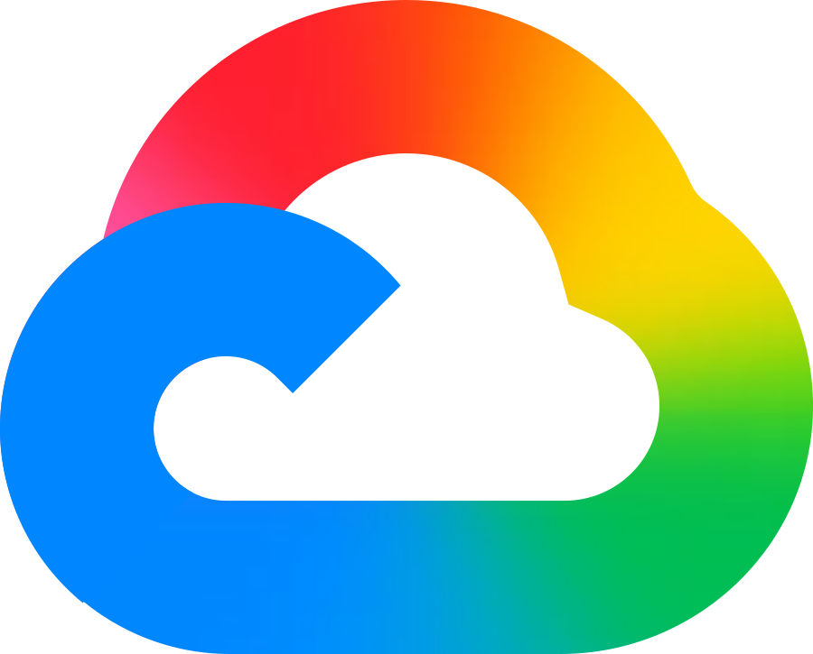 </a
    >&emsp;&emsp;
    <a href="https://aws.amazon.com/" target="_blank">
       </a
    >&emsp;&emsp;
    <a href="https://www.oracle.com/in/cloud/" target="_blank">
       </a
    >&emsp;&emsp;
    <a href="https://cloud.ibm.com/login" target="_blank">
      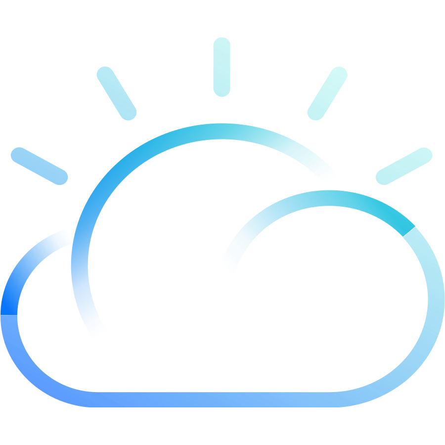 </a
    >&emsp;&emsp;
  

<!--🧠 Operating Systems I Have Used -->
 

  

    <h2 style="display: inline">
      <strong>🧠 Operating Systems I Have Used</strong>
    </h2>
  

  

    <a href="https://www.linux.org/" target="_blank">
       </a
    >&emsp;&emsp;
    <a href="https://ubuntu.com/" target="_blank">
       </a
    >&emsp;&emsp;
    <a href="https://linuxmint.com/" target="_blank">
       </a
    >&emsp;&emsp;
    <a href="https://www.centos.org/" target="_blank">
       </a
    >&emsp;&emsp;
    <a href="https://en.wikipedia.org/wiki/Windows_11" target="_blank">
       </a
    >&emsp;&emsp;
    <a href="https://en.wikipedia.org/wiki/Windows_10" target="_blank">
      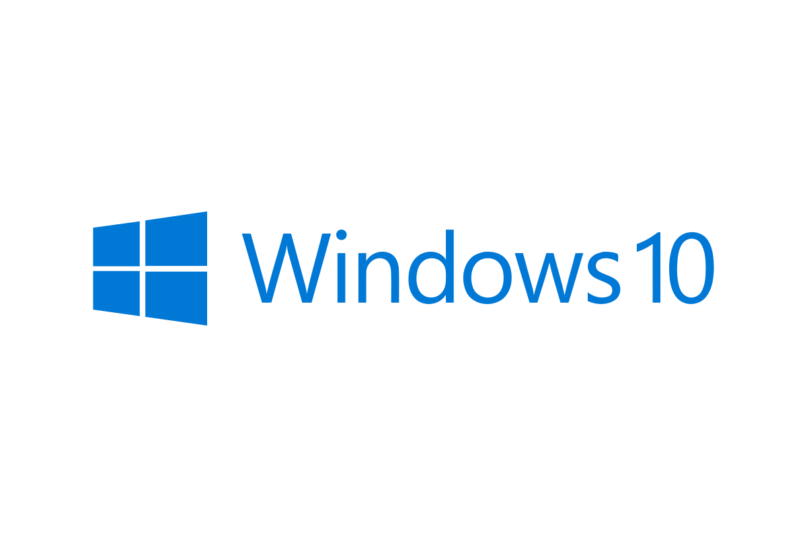 </a
    >&emsp;&emsp;
    <a href="https://en.wikipedia.org/wiki/Windows_8" target="_blank">
       </a
    >&emsp;&emsp;
    <a href="https://en.wikipedia.org/wiki/Windows_7" target="_blank">
       </a
    >&emsp;&emsp;
    <a href="https://en.wikipedia.org/wiki/Windows_XP" target="_blank">
       </a
    >&emsp;&emsp;
    <a href="https://en.wikipedia.org/wiki/MS-DOS" target="_blank">
       </a
    >&emsp;&emsp;
    <a
      href="https://apps.apple.com/us/app/macos-big-sur/id1526878132?mt=12"
      target="_blank"
    >
       </a
    >&emsp;&emsp;
    <a href="https://developer.android.com/" target="_blank">
       </a
    >&emsp;&emsp;
    <a href="https://developer.apple.com/ios/" target="_blank">
       </a
    >&emsp;&emsp;
    <a href="https://en.wikipedia.org/wiki/BlackBerry_OS" target="_blank">
       </a
    >&emsp;&emsp;
    <a href="https://en.wikipedia.org/wiki/Windows_phone" target="_blank">
       </a
    >&emsp;&emsp;
    <a href="https://en.wikipedia.org/wiki/Symbian" target="_blank">
       </a
    >&emsp;&emsp;
  

<!-- My Preferred Collaboration Tools -->
 

  

    <h2 style="display: inline">
      <strong>🤝 My Preferred Collaboration Tools</strong>
    </h2>
  

  

    <a href="https://discord.com/" target="_blank">
       </a
    >&emsp;&emsp;
    <a href="https://www.whatsapp.com/" target="_blank">
       </a
    >&emsp;&emsp;
    <a
      href="https://www.microsoft.com/en-ww/microsoft-teams/group-chat-software"
      target="_blank"
    >
       </a
    >&emsp;&emsp;
    <a href="https://www.atlassian.com/software/jira" target="_blank">
       </a
    >&emsp;&emsp;
    <a href="https://www.atlassian.com/software/confluence" target="_blank">
       </a
    >&emsp;&emsp;
    <a href="https://chat.google.com/" target="_blank">
       </a
    >&emsp;&emsp;
    <a href="https://planner.cloud.microsoft/" target="_blank">
       </a
    >&emsp;&emsp;
    <a href="https://slack.com/intl/en-in" target="_blank">
       </a
    >&emsp;&emsp;
    <a href="https://meet.google.com/" target="_blank">
       </a
    >&emsp;&emsp;
    <a href="https://zoom.us/" target="_blank">
       </a
    >&emsp;&emsp;
    <a href="https://www.webex.com/" target="_blank">
       </a
    >&emsp;&emsp;
    <a href="https://github.com/dibyarupnath/" target="_blank">
       </a
    >&emsp;&emsp;
    <a href="https://telegram.org/" target="_blank">
       </a
    >&emsp;&emsp;
    <a href="https://gitter.im/" target="_blank">
       </a
    >&emsp;&emsp;
    <a href="https://signal.org/" target="_blank">
       </a
    >&emsp;&emsp;
    <a
      href="https://www.microsoft.com/en-in/microsoft-365/microsoft-lists"
      target="_blank"
    >
       </a
    >&emsp;&emsp;
    <a href="https://trello.com/" target="_blank">
       </a
    >&emsp;&emsp;
  

<!-- Productivity Tools I Use -->
 

  

    <h2 style="display: inline">
      <strong>💡 Productivity Tools I Use</strong>
    </h2>
  

  

    <a href="https://www.google.com/calendar" target="_blank">
       </a
    >&emsp;&emsp;
    <a href="https://www.notion.so/" target="_blank">
      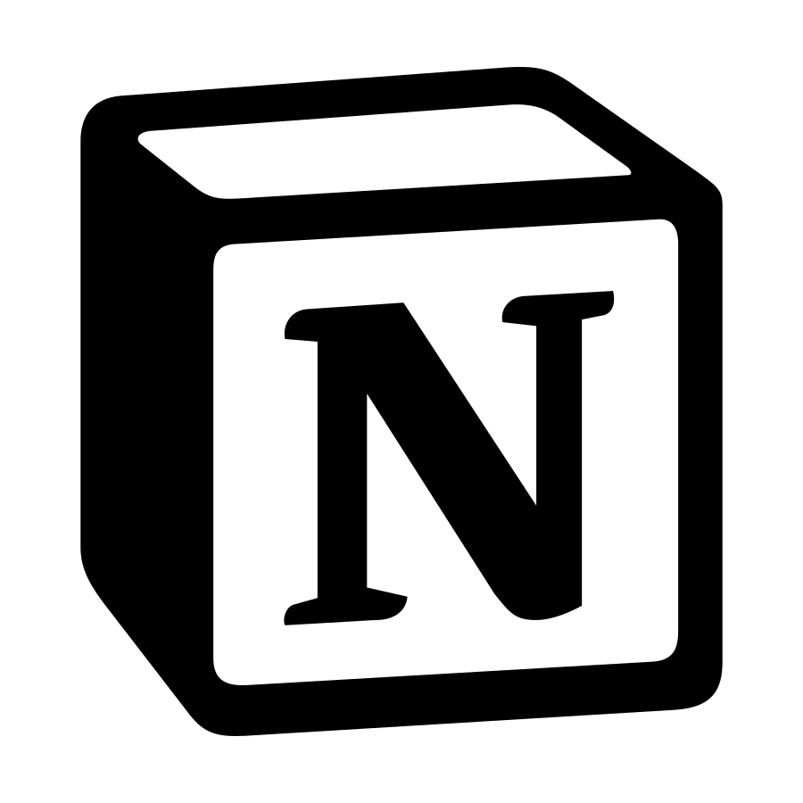 </a
    >&emsp;&emsp;
    <a href="https://onenote.cloud.microsoft/" target="_blank">
       </a
    >&emsp;&emsp;
    <a href="https://keep.google.com/" target="_blank">
       </a
    >&emsp;&emsp;
    <a href="https://todo.microsoft.com/" target="_blank">
       </a
    >&emsp;&emsp;
    <a href="https://tasks.google.com/tasks/" target="_blank">
       </a
    >&emsp;&emsp;
    <a href="https://habitica.com" target="_blank">
       </a
    >&emsp;&emsp;
    <a href="https://github.com/dibyarupnath/" target="_blank">
       </a
    >&emsp;&emsp;
    <a href="https://en.wikipedia.org/wiki/Windows_Notepad" target="_blank">
       </a
    >&emsp;&emsp;
  

<!-- Office Tools I Use -->
 

  

    <h2 style="display: inline"><strong>💼 Office Tools I Use</strong></h2>
  

  

    <a href="https://www.office.com/launch/excel/" target="_blank">
       </a
    >&emsp;&emsp;
    <a href="https://www.office.com/launch/powerpoint/" target="_blank">
      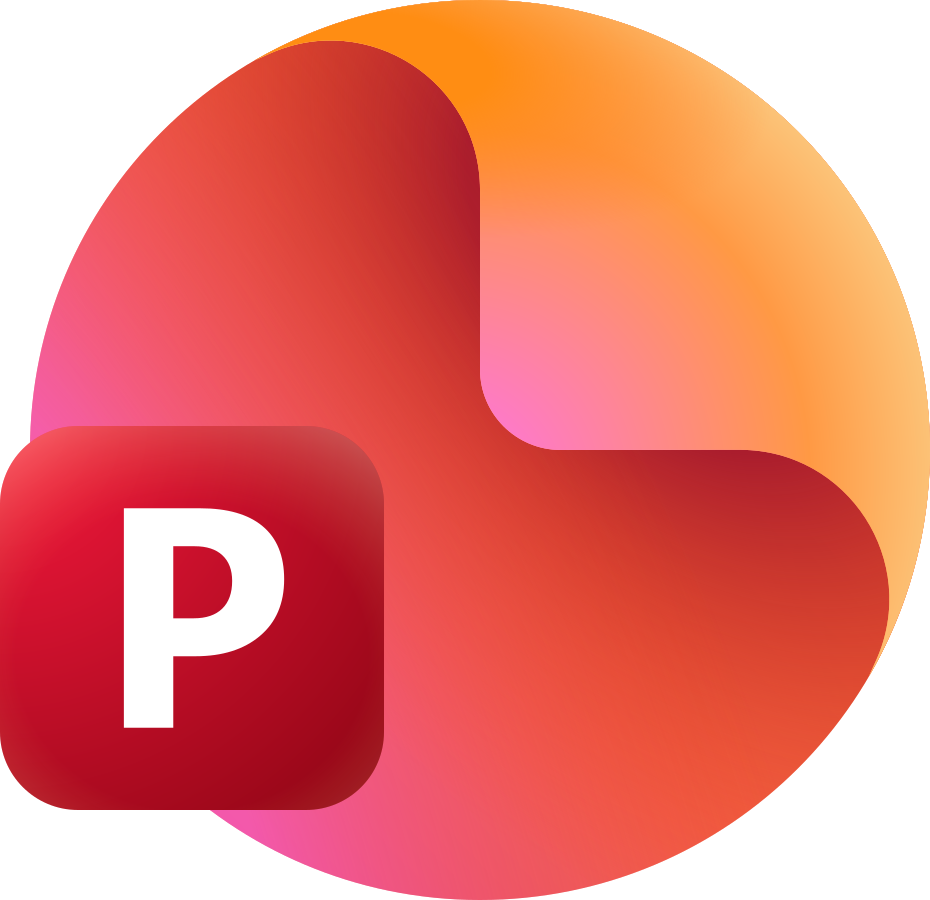
    </a>
    &emsp;&emsp;
    
    &emsp;&emsp;
    
    &emsp;&emsp;
    
    &emsp;&emsp;
    <a href="https://www.google.com/docs/about/" target="_blank">
       </a
    >&emsp;&emsp;
    <a href="https://docs.google.com/forms" target="_blank">
       </a
    >&emsp;&emsp;
    <a href="https://drive.google.com/drive/" target="_blank">
       </a
    >&emsp;&emsp;
    <a href="https://onedrive.live.com/" target="_blank">
       </a
    >&emsp;&emsp;
    <a href="https://outlook.live.com/" target="_blank">
       </a
    >&emsp;&emsp;
  

<!-- Creative Software/Services I Use/Learn -->
 

  

    <h2 style="display: inline">
      <strong>🧙 Creative Software/Services I Use/Learn 🔮</strong>
    </h2>
  

  

    <a href="https://www.canva.com/" target="_blank">
       </a
    >&emsp;&emsp;
    <a href="https://github.com/dibyarupnath/" target="_blank">
       </a
    >&emsp;&emsp;
    <a href="https://jitter.video/" target="_blank">
       </a
    >&emsp;&emsp;
    <a href="https://www.postermywall.com/" target="_blank">
       </a
    >&emsp;&emsp;
    <!-- &emsp;&emsp;
    &emsp;&emsp;
    &emsp;&emsp;
    <a href="https://github.com/dibyarupnath/" target="_blank"> 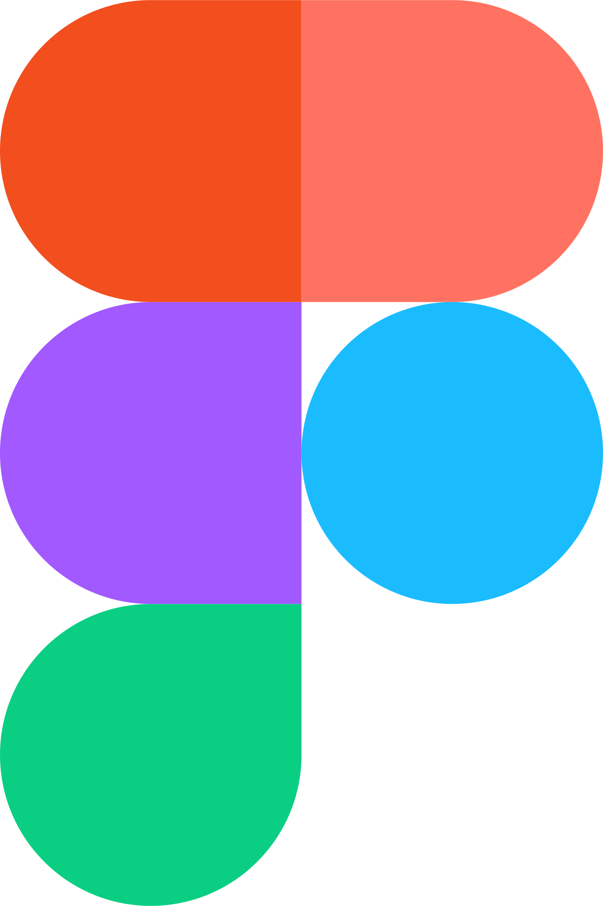 </a>&emsp;&emsp; -->
    <a href="https://krita.org/en/" target="_blank">
       </a
    >&emsp;&emsp;
    <a href="https://www.adobe.com/in/products/photoshop.html" target="_blank">
       </a
    >&emsp;&emsp;
    <a
      href="https://www.adobe.com/in/products/illustrator.html"
      target="_blank"
    >
       </a
    >&emsp;&emsp;
    <!-- &emsp;&emsp;
    &emsp;&emsp; -->
  

<!-- My GitHub Stats -->
 

  

    <h2 style="display: inline"><strong>📈 My GitHub Stats</strong></h2>
  

  <!-- Widgets by Anura Ghazra (anuraghazra) -->
  

    <a href="https://github.com/DenverCoder1/github-readme-streak-stats"
      ></a
    >&nbsp;&nbsp;&nbsp;&nbsp;&nbsp;&nbsp;
  

<!-- Contributors to this Repo -->
<h3><strong>Contributors to this Repository: </strong></h3>

<!-- <h3><strong>Codewars Stats: </strong></h3>

-->

<!-- <h3><strong>LeetCode Stats: </strong></h3>

  -->

<!-- 

 -->

<!-- ## Most valuable repo

https://github.com/Jurredr/github-widgetbox

 -->

<!-- MD LINK REFERENCES -->

[Techno India University]: https://www.technoindiauniversity.ac.in/
[The Rotaract Club of Calcutta Presidency]: https://www.facebook.com/rccalprez/
