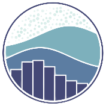
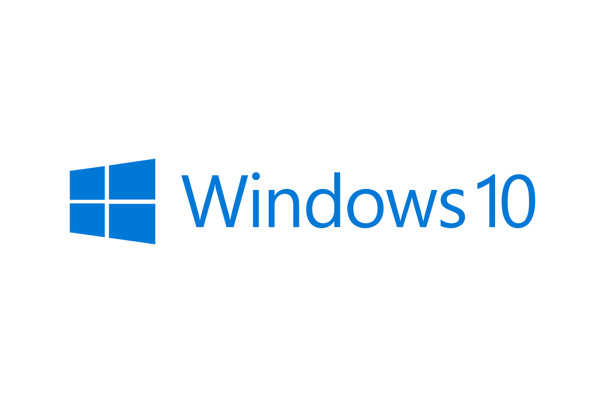

<h5 style="color: yellowgreen;">Jio has blocked <a src="raw.githubusercontent.com">raw.githubusercontent.com</a> in India. If you are using Jio, Please use a VPN or configure <a src="https://developers.google.com/speed/public-dns/docs/using">Google DNS => 8.8.8.8 and 8.8.4.4</a>. I will be slowly replacing the direct icon paths with CDN paths.</h5>
 

<!--
**dibyarupnath/dibyarupnath** is a ✨ _special_ ✨ repository because its `README.md` (this file) appears on your GitHub profile.
-->

<h2 align="center"><strong>💁🏻‍♂️ About Me</strong></h2>

- 📖 Pursuing **B.Tech** in **Computer Science and Engineering** from **[Techno India University]**.

- 🖥️ Fields that interest me most include **Data Science, Machine Learning, Deep Learning, Computer Vision, and Self-Driving Cars**.

- 📷 My hobbies include **Chess, Wildlife Photography, Linguistics, Cooking, and Lawn Tennis**.

- 🖋️ General Member [Social Media Team] at **[The Rotaract Club of Calcutta Presidency]**.

<!-- Let's Connect  -->
 
<h2 align="center"><strong>➕ Let's Connect </strong></h2>

    &emsp;&emsp;
     &emsp;&emsp;
     &emsp;&emsp;
     &emsp;&emsp;
     &emsp;&emsp;
     &emsp;&emsp;
    <!-- &emsp;&emsp; -->

    <!--  &emsp;&emsp; -->
    <!--  &emsp;&emsp; -->
    <!--  &emsp;&emsp; -->

<!-- Frameworks & Programming/Scripting Languages I Use/Know -->
 
<h2 align="center"><strong>📜 Frameworks & Programming/Scripting Languages I Use/Know</strong></h2>

    &emsp;&emsp;
     &emsp;&emsp;
     &emsp;&emsp;
     &emsp;&emsp;
     &emsp;&emsp;
    <!--  &emsp;&emsp;
     &emsp;&emsp; -->
    <!-- &emsp;&emsp; -->
    &emsp;&emsp;
     &emsp;&emsp;
     &emsp;&emsp;
     &emsp;&emsp;
     &emsp;&emsp;
     &emsp;&emsp;
     &emsp;&emsp;
     &emsp;&emsp;

<!-- &emsp;&emsp;
&emsp;&emsp; -->
<!-- Frameworks & Programming/Scripting Languages I Learn -->
 
<h2 align="center"><strong>📖 Frameworks & Programming/Scripting Languages I Learn</strong></h2>

    &emsp;&emsp;
    <!--  &emsp;&emsp; -->
    &emsp;&emsp;
    <!--  &emsp;&emsp; -->
    <!--  &emsp;&emsp; -->
    <!-- &emsp;&emsp; -->
     &emsp;&emsp;
    <!-- &emsp;&emsp; -->
    <!-- &emsp;&emsp; -->
    <!--  &emsp;&emsp; -->
    <!--  &emsp;&emsp; -->

<!-- Databases & Data-Management Tools I Use & Learn -->
 
<h2 align="center"><strong>🗄️ Databases & Data-Management Tools I Use & Learn</strong></h2>

    &emsp;&emsp;
     &emsp;&emsp;
     &emsp;&emsp;
    <!--  &emsp;&emsp;
     &emsp;&emsp;
     &emsp;&emsp;
     &emsp;&emsp; -->
    <!--  &emsp;&emsp;
    &emsp;&emsp; -->

<!-- IDEs & Other Technial Services I Use/Learn -->
 
<h2 align="center"><strong>🗝️ IDEs & Other Technial Services I Use/Learn</strong></h2>

    &emsp;&emsp;
     &emsp;&emsp;
    <!--  &emsp;&emsp; -->
    &emsp;&emsp;
    <!-- &emsp;&emsp; -->
    <!-- &emsp;&emsp;
    &emsp;&emsp;
    &emsp;&emsp;
    &emsp;&emsp;
    &emsp;&emsp; -->
    &emsp;&emsp;
    <!-- &emsp;&emsp; -->
     &emsp;&emsp;
    <!-- &emsp;&emsp; -->
    <!-- &emsp;&emsp; -->
    &emsp;&emsp;
    <!-- &emsp;&emsp; -->
     &emsp;&emsp;
    &emsp;&emsp;
    <!-- &emsp;&emsp; -->
    &emsp;&emsp;
    <!-- &emsp;&emsp; -->
    <!-- &emsp;&emsp; -->

<!-- Cloud Platforms I Use & Learn -->
 
<h2 align="center"><strong>☁️ Cloud Platforms I Use & Learn</strong></h2>

    &emsp;&emsp;
    <!-- &emsp;&emsp; -->
    <a href="https://azure.microsoft.com/en-in/" target="_blank"> 
    <!-- </a>&emsp;&emsp;&emsp;&emsp;  -->
    <!-- <a href="https://github.com/dibyarupnath" target="_blank">  -->

<!-- Virtualization Software I Use -->
<!--  
<h2 align="center"><strong>💻 Virtualization Software I Use</strong></h2>

    &emsp;&emsp;
    &emsp;&emsp;

 -->

<!-- Operating Systems I Have Used -->
 
<h2 align="center"><strong>🖥️ Operating Systems I Have Used</strong></h2>

    &emsp;&emsp;
    &emsp;&emsp;
    &emsp;&emsp;
    &emsp;&emsp;
    &emsp;&emsp;
    &emsp;&emsp;
    &emsp;&emsp;
    &emsp;&emsp;
    &emsp;&emsp;
    &emsp;&emsp;
    &emsp;&emsp;
    &emsp;&emsp;
    <!-- &emsp;&emsp;
    &emsp;&emsp; -->

<!-- My Preferred Collaboration Tools -->
 
<h2 align="center"><strong>🤝 My Preferred Collaboration Tools</strong></h2>

    &emsp;&emsp;
    &emsp;&emsp;
    &emsp;&emsp;
    &emsp;&emsp;
    &emsp;&emsp;
    &emsp;&emsp;
    &emsp;&emsp;
    &emsp;&emsp;
    <!-- &emsp;&emsp; -->
    <!-- &emsp;&emsp; -->
    &emsp;&emsp;

<!-- Office Tools I Use -->
 
<h2 align="center"><strong>💼 Office Tools I Use</strong></h2>

    &emsp;&emsp;
     &emsp;&emsp;
     &emsp;&emsp;
    &emsp;&emsp;
     &emsp;&emsp;
     &emsp;&emsp;
     &emsp;&emsp;
     &emsp;&emsp;
    &emsp;&emsp;
    &emsp;&emsp;
    &emsp;&emsp;
    <!-- &emsp;&emsp; -->
    &emsp;&emsp;
    <!-- &emsp;&emsp; -->

<!-- Creative Softwares/Services I Use/Learn -->
 
<h2 align="center"><strong>🧙 Creative Softwares/Services I Use/Learn 🔮</strong></h2>

    &emsp;&emsp;
    &emsp;&emsp;
    &emsp;&emsp;
    &emsp;&emsp;
    <!-- &emsp;&emsp;
    &emsp;&emsp;
    &emsp;&emsp;
    &emsp;&emsp; -->
    &emsp;&emsp;
    &emsp;&emsp;
    &emsp;&emsp;
    <!-- &emsp;&emsp;
    &emsp;&emsp; -->

<!-- Generate Random Jokes
 
<h2 align="center"><strong>😉 Random Jokes 😆</strong></h2>

 -->

<!-- My GitHub Stats -->
<h2 align="center"><strong>📈 My GitHub Stats</strong></h2>

<!-- Widgets by Anura Ghazra (anuraghazra) -->

    &nbsp;&nbsp;&nbsp;&nbsp;&nbsp;&nbsp;&nbsp;&nbsp;&nbsp;&nbsp;&nbsp;&nbsp;

<!-- Trophies -->

    

<!-- 
The following markdown is the code for the above Trophies add-on, but I converted it to HTML and pasted above this comment, because I wanted to center it using 

 -->
<!--  -->
<!-- Quine Widgets -->

    &nbsp;&nbsp;&nbsp;&nbsp;&nbsp;&nbsp;<!-- &nbsp;&nbsp;&nbsp;&nbsp;&nbsp;&nbsp; &nbsp;&nbsp;&nbsp;&nbsp;&nbsp;&nbsp;  -->

<!-- Miscellaneous Information -->
 <h2 align="center"><strong>🗂️ Miscellaneous Information</strong></h2>
<!-- Profile Visitors -->
<h3><strong>Profile Visitors' Count: </strong></h3>

&nbsp;&nbsp;&nbsp;&nbsp;&nbsp;

<!-- Contributors to this Repo -->
<h3><strong>Contributors to this Repository: </strong></h3>

<!-- <h3><strong>Codewars Stats: </strong></h3>

-->

<!-- <h3><strong>LeetCode Stats: </strong></h3>

  -->

<!-- 

 -->

<!-- ## Most valuable repo

https://github.com/Jurredr/github-widgetbox

 -->

<!-- LINK REFERENCES -->
<!-- Linktree Profile: -->

<!-- Social Media Links: -->

<!-- Coding Profile Links: -->

<!-- [Google Developer Profile]: https://developers.google.com/profile/u/dibyarupnath/ -->

<!-- Badge Profile Links: -->
<!-- [Credly Profile]: https://www.credly.com/users/dibyarupnath/
[Holopin Badge Profile]: https://www.holopin.io/@dibyarupnath/ -->

<!-- Other Profiles:  -->
[Techno India University]: https://www.technoindiauniversity.ac.in/
[The Rotaract Club of Calcutta Presidency]: https://www.facebook.com/rccalprez/
